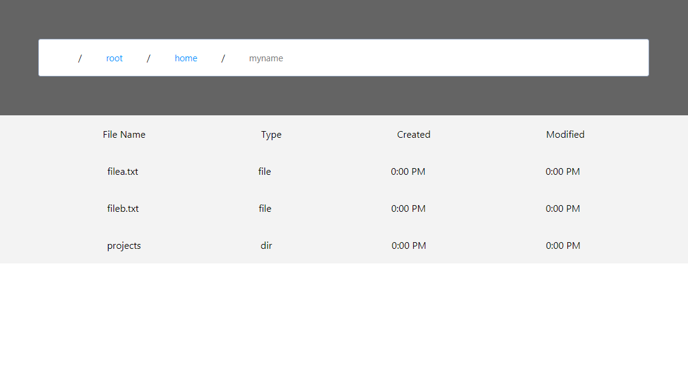

# React Breadcrumb Filestructure Component

# Build and host locally yourself:

`git clone https://github.com/e-Dylan/parsehub-breadcrumb-component`

`npm install`

`npm start`

Server is hosted at `localhost:3000`.

File structure is located in `src/App.js` as the "root" variable. File structures of the same format will work properly, with any new files or directories.
